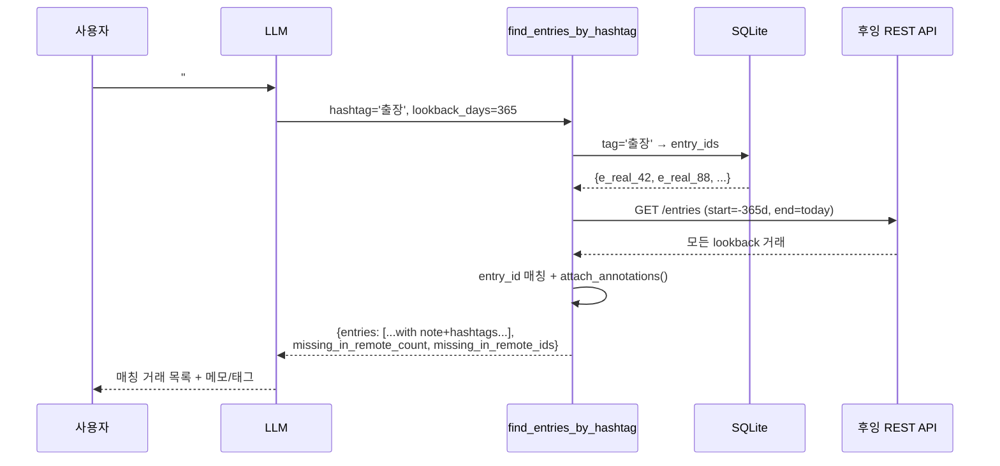

# whooing-mcp-server-wrapper 설계 문서 (v2)

> 외부 노출명은 `whooing-mcp-server-wrapper` (GitHub repo + PyPI dist name).
> 본 워크스페이스의 Perforce 경로 (`//woojinkim/scripts/whooing-mcp-server/...`)
> 와 Python import path (`whooing_mcp`) 는 호환성을 위해 변경하지 않음.

이 문서는 [whooing.com](https://whooing.com) (이하 **후잉**) 가계부의 **공식
MCP 서버**(`https://whooing.com/mcp`) 위에서 동작하는 **보완 도구 묶음**의
설계를 정리한다. Claude Code / Claude Desktop 사용자는 공식 MCP 와 본
wrapper MCP 를 함께 등록해, 자연어로 가계부를 다루면서 공식이 제공하지
않는 영역(결제 알림 파싱 / LLM 입력 audit / 카드명세서 CSV 정산)을 추가로
사용한다.

> 본 문서는 **현재 시점의 스냅샷**이며, 코드와 어긋날 경우 항상 코드가
> 우선한다. 큰 변경 시 같은 changelist 에서 본 문서를 함께 갱신한다.

---

## §0. 변경 이력

| 버전 | 날짜 | CL | 요약 |
|---|---|---|---|
| v1 | 2026-05-09 | CL 50633 | 후잉 12 read/write API 를 자체 MCP 도구로 구현하는 안. 폐기됨 (§3.1). |
| **v2** | **2026-05-09** | **본 CL** | **공식 MCP wrapper 모델로 전면 재작성.** 5개 wrapper 도구. AI 연동 토큰 단일 인증. |

v1 → v2 정정 항목:
- 후잉이 **공식 MCP 서버 운영 중** (`https://whooing.com/mcp`) — v1 의 12
  도구 자체 구현은 기능 중복으로 정당성 상실.
- 후잉 인증은 **AI 연동 토큰** (`X-API-Key: __eyJh...`) 또는 **OAuth2 PKCE**
  지원. v1 의 5필드 X-API-KEY 는 legacy.
- 공식 rate limit **분당 20 / 일 20,000**. v1 의 분당 60 cap 추측은 느슨했음.
- 응답에 `rest_of_api` 필드가 매번 포함 → 클라이언트 측 카운터 불필요.

---

## §1. 목표

공식 후잉 MCP 가 잘 하는 일은 손대지 않는다 (거래 CRUD / 보고서 / 예산 /
포스트잇 등). 본 서버는 **공식이 안 주는 3가지 워크플로우**만 채운다:

1. **SMS/Push 결제알림 → 후잉 항목 제안**
   "신한카드 승인 6,200원 스타벅스..." 같은 한 줄을 붙여넣으면 LLM 이 우리
   `whooing_parse_payment_sms` 도구로 구조화된 항목 dict 를 받아 사용자에게
   확인받고, 그 후 **공식 MCP 의 add_entry** 를 호출.
2. **LLM-입력 audit + 중복 탐지**
   LLM 이 메모에 `[ai]` 마커를 붙여 입력한 거래만 골라보기 + 같은 금액/유사
   item 의 중복 후보 찾기. 안전망.
3. **카드명세서 CSV bulk reconcile**
   카드사가 매월 주는 CSV 를 후잉의 같은 기간 항목과 매칭. 누락/잉여
   목록을 LLM 에 반환 → 사용자와 상의 후 공식 MCP 로 보충.

품질 기준:
- **stateless wrapper 우선**. 도구 1회 호출로 자기-완결되는 결과 반환.
  로컬 상태(예: audit log)는 후잉 자체 데이터로부터 재구성 가능해야 한다.
- **자동 입력 X**. 우리 도구는 _제안_ 만 한다. 실제 입력은 사용자가 LLM
  대화로 확인 후 공식 MCP 가 한다.
- 자격증명 마스크, rate-limit 친화적, KST 명시.

---

## §2. 비-목표

| 항목 | 안 하는 이유 |
|---|---|
| 후잉 거래 CRUD 도구 (`add_entry`, `entries`, `pl`, `balance`...) | **공식 MCP 가 함**. 우리는 wrapper. |
| 거래 자동 입력 (사용자 확인 없이) | 재무 데이터 — 항상 human-in-the-loop |
| 후잉 외 가계부 통합 (뱅크샐러드/토스/Mint) | 별 프로젝트로 |
| OAuth2 클라이언트 구현 | v1 단일 사용자 → AI 토큰으로 충분. 다중 사용자 시 §14 |
| 멀티사용자 동시 처리 | MCP 인스턴스 분리로 해결 |
| SMS 자동 수신/포워딩 (Tasker / iOS Shortcut 등) | 본 서버 범위 외. 사용자가 텍스트만 LLM 에 붙여넣으면 됨 |
| OCR / Vision 영수증 처리 | Claude 가 native vision. 우리 서버 가치 없음 |
| 그래프/차트 렌더링 | MCP 는 구조화 데이터만, 시각화는 호스트 책임 |

---

## §3. 방향 결정 + 타당성

### §3.1 왜 wrapper 인가 (v1 폐기 사유)

v1 작성 시 (CL 50633) 다음 두 사실을 누락:

1. `https://whooing.com/mcp` — 후잉이 직접 호스팅하는 공식 MCP 서버.
2. `https://whooing.com/api/docs` — OAuth2 PKCE + AI 토큰 기반 공식
   REST API 명세.

같은 날 사용자가 이 두 URL 을 제공해 정정. 공식 MCP 가 v1 계획의 12 도구
영역을 모두 커버하므로 자체 구현은 기능 중복. 우리가 해야 할 일은 **공식이
안 주는 영역만 채우는 것**으로 좁혀짐.

### §3.2 wrapper 모델은 기술적으로 가능한가

**예.** 두 가지 경로 모두 가능:

- **경로 A (선택):** 우리 wrapper MCP 는 후잉 REST API 를 직접 호출
  (httpx + AI 토큰). 공식 MCP 와는 같은 토큰을 공유하지만 직접 통신 X.
- 경로 B (선택 안 함): 우리 wrapper 가 공식 MCP 의 HTTP MCP 엔드포인트를
  호출. chained MCP. 의존성 늘어남, 디버깅 어려움.

A 가 단순. 사용자는 Claude 에 **공식 MCP + 우리 wrapper MCP** 두 개를
등록하고 같은 AI 토큰을 두 곳에 공급한다.

### §3.3 남은 미확정

| 항목 | 해소 방법 |
|---|---|
| 공식 MCP 가 입력한 entry 가 우리 audit 마커를 자동으로 박는가? | NO 가정. README 로 LLM 에 "우리 audit 도구로 추적되려면 메모에 `[ai]` 접두" 를 안내 |
| Push 알림 본문 정형 (캐리어/은행 별) | Phase 3 에서 1~2개 issuer 로 시작, 이후 점진 추가 |
| CSV 포맷 다양성 | Phase 4 에서 1~2개 카드사 어댑터부터 |

---

## §4. 후잉 공식 MCP + REST API 표면 (요약)

상세는 [`whooing.com/mcp`](https://whooing.com/mcp) /
[`whooing.com/api/docs`](https://whooing.com/api/docs) 참조. 본 절은
**우리 wrapper 가 의존하는 부분만**.

### §4.1 인증

```
X-API-Key: __eyJh...
```
- 발급: 후잉 → 사용자 > 계정 > 비밀번호 및 보안 > AI 토큰 발급
- **앞 underscore 2개 포함 전체** 가 토큰
- scope: `read`, `write`, `messages`, `post_it`, `bbs` (발급 시 선택)
- 우리 wrapper 는 v1 에 `read` 만 필요 (입력은 공식 MCP 가 함)

### §4.2 우리가 호출하는 엔드포인트 (read-only)

| 용도 | URL | 도구 |
|---|---|---|
| 섹션 목록 (default 결정) | `GET /api/sections.json` | bootstrap |
| 항목 조회 (audit / dedup / reconcile) | `GET /api/entries.json?section_id=...&start_date=...&end_date=...` | 모든 v1 도구 |

`section_id` 는 환경변수 default + 도구별 override.
날짜는 `YYYYMMDD`. 한 호출의 date range 는 1년 이내.

### §4.3 응답 포맷

```json
{
  "code": 200,
  "message": "",
  "error_parameters": {},
  "rest_of_api": 4988,
  "results": { ... }
}
```

`rest_of_api` 가 0 에 가까우면 우리 도구는 일찍 abort + 사용자에게 안내.

### §4.4 HTTP 코드 처리

| 코드 | 우리 처리 |
|---|---|
| 200 | 정상 |
| 204 | 빈 결과 — 도구는 빈 배열 반환 (에러 X) |
| 400 | 입력 오류 — `ToolError(USER_INPUT)` |
| 401 | 토큰 무효 — 한글 메시지 "AI 토큰 만료. 후잉에서 재발급" |
| 402 | 일일 한도 초과 — 메시지 + `rest_of_api=0` 함께 반환 |
| 405 | revoke — 401 과 동일 처리 |
| 429 | 분당 한도 — 1s, 2s, 4s, 8s backoff (max 4회) |
| 5xx | 1s, 3s 재시도 (max 2회) |

### §4.5 KST 정책

후잉의 모든 날짜는 KST. 우리 서버는 `zoneinfo("Asia/Seoul")` 강제.
"어제/오늘/이번달" 같은 상대 표현은 KST 자정 기준.

---

## §5. 아키텍처

### §5.1 트랜스포트

| 트랜스포트 | v1 | 비고 |
|---|---|---|
| **stdio** | ✓ | Claude Code / Claude Desktop |
| HTTP/SSE | ✗ | v2 wrapper 는 단일 사용자. 데몬화 가치 낮음 |

### §5.2 모듈 분할

```
whooing-mcp-server-wrapper/
├── DESIGN.md                ← 본 문서
├── README.md                ← 사용자 quickstart (공식 MCP 등록 + 우리 등록)
├── pyproject.toml
├── .env.example
├── src/
│   └── whooing_mcp/
│       ├── __init__.py
│       ├── __main__.py
│       ├── server.py        ← MCP server + 5 도구 등록
│       ├── client.py        ← 후잉 REST 호출 (httpx, read-only)
│       ├── auth.py          ← AI 토큰 헤더 빌더 + 마스크
│       ├── models.py        ← Pydantic Section / Entry / SmsParseResult / ReconcileResult
│       ├── dates.py         ← KST 정규화
│       ├── tools/
│       │   ├── audit.py     ← whooing_audit_recent_ai_entries
│       │   ├── dedup.py     ← whooing_find_duplicates
│       │   ├── sms.py       ← whooing_parse_payment_sms
│       │   └── reconcile.py ← whooing_reconcile_csv, whooing_csv_format_detect
│       ├── parsers/
│       │   └── sms/         ← issuer 별 정규식/패턴
│       │       ├── shinhan_card.py
│       │       └── kookmin_card.py
│       ├── csv_adapters/    ← issuer 별 CSV 컬럼 매핑
│       │   ├── shinhan_card.py
│       │   └── kookmin_card.py
│       └── errors.py
├── tests/
│   ├── fixtures/
│   │   ├── entries_sample.json
│   │   ├── sms/             ← 익명화된 실 SMS 텍스트
│   │   └── csv/             ← 익명화된 실 CSV 행
│   ├── test_auth.py
│   ├── test_dates.py
│   ├── test_sms_parsers.py
│   ├── test_dedup.py
│   ├── test_reconcile.py
│   └── test_tools_e2e.py    ← live (env 있으면)
└── examples/
    └── claude_desktop_config.json   ← 공식 + 우리 wrapper 둘 다
```

### §5.3 의존성

| 패키지 | 용도 |
|---|---|
| `mcp >= 1.0` | MCP SDK |
| `httpx` | 후잉 API |
| `pydantic >= 2` | 모델 + 도구 입력 스키마 |
| `python-dotenv` | `.env` |
| `rapidfuzz` | item 유사도 (dedup, reconcile) |
| `tzdata` | Windows KST |

테스트: `pytest`, `respx`, `pytest-asyncio`.

---

## §6. 도구 명세 (v0.1.12: 24개)

### §6.1 `whooing_parse_payment_sms`

**목적:** SMS/Push 알림 본문 1줄을 받아 후잉 항목 후보로 변환. **API
호출 없음** (순수 파싱).

| 입력 | 타입 | 설명 |
|---|---|---|
| `text` | str | SMS/Push 본문 |
| `issuer_hint` | str? | `shinhan_card` / `kookmin_card` / `toss` / `kakaopay` / `auto` |

**출력:**
```python
{
  "proposed_entry": {
    "entry_date": "20260509",      # KST
    "money": 6200,
    "merchant": "스타벅스 강남점",
    "direction": "expense",         # expense | income | transfer
    "suggested_l_account": "외식",  # 카테고리 추정 (모르면 None)
    "suggested_r_account": "신한카드"
  },
  "confidence": 0.85,
  "notes": ["할부 X", "통화: KRW"],
  "parser_used": "shinhan_card.v1"
}
```

LLM 은 이 dict 를 사용자에게 보여주고 확인을 받은 후 **공식 MCP 의
add_entry 도구**로 입력. 우리 도구는 입력하지 않는다.

`suggested_l_account` 가 None 이거나 confidence 가 낮으면 LLM 에 모호함을
명시 → LLM 이 사용자에게 재질문.

### §6.2 `whooing_find_duplicates`

**목적:** 같은 금액 + 유사 item + ±tolerance_days 안 거래쌍을 후보로 반환.

| 입력 | 타입 | 기본 |
|---|---|---|
| `start_date` | YYYYMMDD | — |
| `end_date` | YYYYMMDD | — |
| `section_id` | str? | env default |
| `tolerance_days` | int | 1 |
| `min_similarity` | float | 0.85 |

**출력:**
```python
{
  "pairs": [
    {
      "entry_a": {...},
      "entry_b": {...},
      "why": ["same money 6200", "item similarity 0.93", "1 day apart"]
    }
  ],
  "total_checked": 142
}
```

date range 가 1년 초과 시 분할 호출 + 병합.

### §6.3 `whooing_audit_recent_ai_entries`

**목적:** LLM 이 입력한 거래만 골라보기 (메모 접두로 식별).

| 입력 | 타입 | 기본 |
|---|---|---|
| `days` | int | 7 |
| `marker` | str | `[ai]` |
| `section_id` | str? | env default |

**출력:** `{"entries": [...], "total": N, "marker_used": "[ai]"}`

**규칙:** README + 도구 description 으로 LLM 에 안내 — "사용자 위임으로
add_entry 호출 시 memo 첫 단어로 `[ai]` 를 붙여라". 공식 MCP 의 도구에는
우리가 hook 을 못 건다 → 컨벤션으로 해결.

### §6.4 `whooing_reconcile_csv`

**목적:** 카드명세서 CSV 와 후잉 entries 의 차이.

| 입력 | 타입 | 기본 |
|---|---|---|
| `csv_path` | str (절대) | — |
| `issuer` | str | `auto` |
| `start_date` | YYYYMMDD? | csv min |
| `end_date` | YYYYMMDD? | csv max |
| `section_id` | str? | env default |
| `tolerance_days` | int | 2 |
| `tolerance_amount` | int | 0 |

**출력:**
```python
{
  "summary": {
    "csv_total": 47,
    "whooing_total": 51,
    "matched_count": 44,
    "missing_in_whooing_count": 3,
    "extra_in_whooing_count": 7
  },
  "missing_in_whooing": [...],   # CSV 에 있는데 후잉에 없는 거래
  "extra_in_whooing": [...],     # 후잉에 있는데 CSV 에 없는 거래
  "matched": [...]               # 매칭된 쌍 (요약 통계용)
}
```

매칭 알고리즘: same date ±tolerance + same amount ±tolerance, 그 다음
item 유사도 sort. greedy 1-1 매칭.

### §6.5 `whooing_csv_format_detect`

**목적:** `whooing_reconcile_csv` 가 `issuer` 자동 감지에 실패할 때 사용자
디버깅용.

| 입력 | 타입 |
|---|---|
| `csv_path` | str (절대) |

**출력:**
```python
{
  "detected_issuer": "shinhan_card",
  "confidence": 0.92,
  "header_sample": ["거래일자", "가맹점명", "이용금액", ...],
  "column_mapping_proposed": {
    "date_col": "거래일자",
    "amount_col": "이용금액",
    "merchant_col": "가맹점명"
  },
  "supported_issuers": ["shinhan_card", "kookmin_card"]
}
```

### §6.6 도구 컨벤션

- 모든 입력 Pydantic, JSON Schema 자동 생성.
- 모든 출력 dict (raw 문자열 X).
- 에러 raise → MCP 가 isError 로 변환.
- `section_id` 옵셔널, env default.

### §6.7 Local entry annotations (5 도구)

후잉 자체 `memo` 필드의 한계 (한 줄 / 해시태그 검색 X) 를 보완하기 위해
거래 ID 별로 자유 길이 `note` + 다중 `hashtags` 를 로컬 SQLite 에 저장.
후잉 서버의 거래 자체는 변경 X — 별개의 로컬 메타데이터 레이어.

**저장:** queue 와 같은 SQLite 파일 (`<project>/whooing-data.sqlite`,
`$WHOOING_QUEUE_PATH` override). 두 테이블:

- `entry_annotations(entry_id PK, section_id, note, created_at, updated_at)`
- `entry_hashtags(entry_id, tag, PRIMARY KEY (entry_id, tag))` +
  `INDEX idx_hashtags_tag ON entry_hashtags(tag)` (역방향 조회 빠름)

**도구 5개:**

| 도구 | 입력 | 출력 |
|---|---|---|
| `whooing_set_entry_note` | `entry_id`, `note?`, `hashtags?`, `section_id?` | `{annotation: {entry_id, note, hashtags, section_id, created_at, updated_at}}` |
| `whooing_get_entry_annotations` | `entry_ids: str \| list[str]` | `{annotations: {eid: {...}}, found_count, queried_count}` |
| `whooing_remove_entry_note` | `entry_id` | `{removed: bool, entry_id}` |
| `whooing_list_hashtags` | `prefix?` | `{hashtags: [{tag, count}], total_unique, prefix_filter}` |
| `whooing_find_entries_by_hashtag` | `hashtag`, `section_id?`, `lookback_days=365` | `{entries: [...with local_annotations attached...], total, hashtag_searched, missing_in_remote_count, missing_in_remote_ids}` |

**해시태그 정규화:** `parse_hashtag_input()` 가 처리.

- 입력 형태: `["식비", "#출장"]` (list) 또는 `"#식비 #출장"` (string, 공백/콤마 분리)
- 정규화: `#` strip, 양옆 whitespace strip, 빈 토큰 reject, 내부 공백 reject
- 대소문자 변환 X (한글 무관, 영문 사용자 의도 보존)
- list 입력 시 dedupe (보존 순서)

**자동 부착:** `attach_annotations(entries)` 헬퍼가 entries dict 리스트의
각 항목에 `local_annotations: {note, hashtags} | None` 필드 추가. 입력
mutate X. 다음 도구가 자동 호출:

- `whooing_audit_recent_ai_entries` → 결과 entries 에 부착
- `whooing_find_entries_by_hashtag` → 결과 entries 에 부착

`find_duplicates` / `reconcile_*` / `monthly_close` 는 응답 크기 제어
위해 자동 부착 X — 필요 시 LLM 이 별도 `whooing_get_entry_annotations`
호출.

**역방향 조회 흐름** (`whooing_find_entries_by_hashtag`):



**비-목표** (의도된 미구현):

- 해시태그 추천 / 자동 태깅 — LLM 이 컨텍스트로 직접 제안하는 게 더 자연스러움
- AND/OR 다중 태그 쿼리 — 단일 태그만 v0.1. 필요 시 향후 `tags: list[str], op='and'` 인자로 확장
- 해시태그 rename — `whooing_remove_entry_note` + `whooing_set_entry_note` 조합으로 사용자가 명시적 처리

### §6.8 명세서 자동 import + 거래 영구 삭제 (3 도구) — Chained MCP

`whooing_import_pdf_statement` (#20) / `whooing_import_html_statement` (#21) /
`whooing_delete_entries` (#19). DESIGN v2 §2 의 "거래 자동 입력 X" 정책의
**부분 예외** — 본 wrapper 가 직접 후잉 REST 를 두드리지 않고, **공식 후잉 MCP
(`whooing.com/mcp`) 를 chained-call** 함으로써 정책 일관성 유지.

**왜 chained MCP 인가:**

- 후잉 REST 의 DELETE 메서드 형식이 우리 직접 호출에 응답 안 함 (5+ 패턴 시도 실패).
  공식 MCP `entries-delete` 는 정상 동작.
- 공식 MCP 가 schema validation / scope check / 다국어 에러 등 잘 구현되어 있음.
- 향후 후잉 API 변경 시에도 공식 MCP layer 가 감수 → 우리 wrapper 는 안정적.

**`OfficialMcpClient` (`src/whooing_mcp/official_mcp.py`):**

```mermaid
sequenceDiagram
    participant Tool as wrapper tool<br/>(import / delete)
    participant Cl as OfficialMcpClient
    participant Off as 공식 MCP<br/>(whooing.com/mcp)

    Tool->>Cl: call_tool('entries-create' or 'entries-delete', args)
    Cl->>Off: POST /mcp (JSON-RPC tools/call)<br/>X-API-Key: __eyJh...
    Note over Off: stateless — init/initialized handshake 없이 OK
    Off-->>Cl: { result: {content, isError?, structuredContent?} }
    alt isError = True
        Cl-->>Tool: raise OfficialMcpError(extracted text)
    else
        Cl-->>Tool: result dict
    end
```

#### §6.8.1 `whooing_import_pdf_statement`

| 입력 | 타입 | 기본 |
|---|---|---|
| `pdf_path` | str (절대) | — |
| `r_account_id` | str (필수) | — (예: 'x80' 하나카드) |
| `issuer` | str | `'auto'` |
| `section_id` | str? | env default |
| `card_label` | str? | None — memo + tracking |
| `dedup_tolerance_days` | int | 2 |
| `auto_categorize` | bool | True (suggest_category 호출) |
| `fallback_l_account_id` | str | `'x50'` 식비 |
| `dry_run` | bool | **True** (안전) |
| `confirm_insert` | bool | False (dry_run=False 시 필수 True) |

**출력:** `{summary, proposed, matched_existing, inserted, failed, tracking_log_ids, dry_run, note}`

흐름: pdf_adapters 파싱 → `client.list_entries` (paginated) → dedup +
`suggest_category` → dry_run 이면 보고만, 아니면 공식 MCP `entries-create`
loop + `statement_import_log` 기록 + rate limit (분당 18 self-throttle).

#### §6.8.2 `whooing_import_html_statement`

PDF import 와 동일 구조이나:

- 입력 `html_path` + `password_env_var` (default `auto` →
  `WHOOING_CARD_HTML_PASSWORD` 사용. 옛 `WHOOING_HANACARD_PASSWORD` fallback)
- `html_adapters/` 가 Playwright 헤드리스로 client-side 복호화 → DOM 파싱 →
  CSVRow 변환 → 이후는 PDF 와 동일.

지원 (v0.1.11):
  - `hanacard_secure_mail` — 하나카드 (CryptoJS AES, `uni_func()`)
  - `hyundaicard_secure_mail` — 현대카드 (Yettiesoft vestmail, `eval(atob(b_p))`,
    `doAction()`)

**패스워드 정책:** 한국 카드사 모두 사용자 생년월일 6자리 (YYMMDD) 를 보안메일
패스워드로 사용 → 단일 env 키 (`WHOOING_CARD_HTML_PASSWORD`) 공유. 카드사별
분리 키 불필요.

**한계:** 정형 거래 패턴 위주. 해외이용내역 상세 (다른 columns) 일부에서
카드번호가 merchant 로 잡히는 케이스. 새 카드사는 `html_adapters/` 에 issuer
별 모듈 추가 + `__init__.py` registry 등록.

#### §6.8.3 `whooing_delete_entries`

| 입력 | 타입 | 기본 |
|---|---|---|
| `entry_ids` | str \| list[str] | — |
| `section_id` | str? | env default |
| `confirm` | bool | **False** (재무 데이터 영구 삭제 가드 — True 필수) |
| `update_import_log` | bool | True |

**출력:** `{summary, deleted, failed, log_updates, via='official_mcp/entries-delete'}`

흐름: 각 entry_id 마다 공식 MCP `entries-delete` chained-call → 성공 시
`statement_import_log.status='deleted'` 동기화.

### §6.9 거래 ↔ 첨부파일 (3 도구) — 후잉 미지원 영역 보완

후잉이 entry-attachment 미지원이라 본 wrapper 가 별도 layer 운영. PDF 인보이스
/ 영수증 사진 / 계약서 등 supporting docs 를 거래 ID 에 1:N 매핑.

**저장:** queue / annotations 와 같은 SQLite 파일 (schema v4 의 `entry_attachments`
테이블) + 디스크 `attachments/files/YYYY/YYYY-MM-DD/<filename>`.

**SHA256 dedup:** 같은 내용은 한 번만 디스크에 저장. 다른 entry 가 같은 파일
참조 시 row 만 추가 (디스크 재복사 X). 다른 내용·같은 파일명은 `<stem>-N.<ext>`
suffix.

**도구:**

| 도구 | 입력 | 출력 |
|---|---|---|
| `whooing_attach_file_to_entry` | `entry_id`, `file_path` (abs), `section_id?`, `note?`, `attach_date?`, `copy=True` | `{attachment, copied, deduped, p4_sync, note}` |
| `whooing_list_entry_attachments` | `entry_ids: str \| list[str]` | `{attachments_by_entry: {eid: [...]}, total_attachments}` |
| `whooing_remove_attachment` | `attachment_id`, `delete_file=True` | `{removed, deleted_row, file_deleted, file_kept_other_refs, p4_sync}` |

**자동 부착:** `attach_attachments(entries)` 헬퍼가 `local_attachments` 필드
추가 — `local_annotations` 와 같은 패턴. `audit` + `find_entries_by_hashtag`
출력에 자동.

**P4 자동 sync:** `attach_file_to_entry` 호출 시 `sync_paths_to_p4(...,
[db, copied_file])` — db + 새 첨부파일 단일 numbered CL 로 묶여 submit
(v0.1.10).

**빈 CL leak 방지 (v0.1.12):** `sync_paths_to_p4` 의 어느 단계 (add/edit/
submit) 에서 실패가 발생하면 `_cleanup_failed_cl()` 가 자동으로 open 된
파일 revert + `p4 change -d <cl>` 로 numbered CL 을 삭제. 또한
`tests/conftest.py` 가 `autouse` fixture 로 모든 테스트에 대해 p4_sync
강제 disable — 머신 default 가 enabled 여도 pytest tmp_path 에서 sync 가
fire 하지 않음.

**Mirror 정책 (DESIGN §13.2):**
- **GitHub**: `attachments/README.md` 만 commit (디렉터리 용도 설명).
  나머지 모든 첨부파일 차단 — `.gitignore` 의 `attachments/*` +
  `!attachments/README.md` 화이트리스트.
- **Perforce**: `attachments/` 전체 sync (cross-machine via P4d 비공개 개인 서버).

---

## §7. 언어 / 런타임

**Python 3.11+** (v1 결정 유지). 워크스페이스 일관성, Pydantic v2 의 자동
JSON Schema, launchd 통합 패턴 정착.

---

## §8. 시크릿 관리

### §8.1 환경변수 (단순화됨 — v1 의 4개 → v2 의 1+α)

| 키 | 필수 | 설명 |
|---|---|---|
| `WHOOING_AI_TOKEN` | ✓ | `__eyJh...` 전체 |
| `WHOOING_SECTION_ID` | △ | 섹션 1개만 쓸 때 default. 없으면 첫 섹션 자동 |
| `WHOOING_BASE_URL` | △ | 기본 `https://whooing.com/api` |
| `WHOOING_HTTP_TIMEOUT` | △ | 기본 10초 |
| `WHOOING_LOG_LEVEL` | △ | `INFO` |
| `WHOOING_RPM_CAP` | △ | client-side rate cap (기본 20) |
| `WHOOING_CARD_HTML_PASSWORD` | △ | `whooing_import_html_statement` 가 사용. 한국 카드사 (하나/현대/...) 모두 공통 — 생년월일 6자리 (YYMMDD). 옛 `WHOOING_HANACARD_PASSWORD` 도 backward-compat fallback |
| `WHOOING_QUEUE_PATH` | △ | SQLite db override (default `<project>/whooing-data.sqlite`) |
| `WHOOING_CONFIG` | △ | TOML 옵션 파일 override |

### §8.2 로딩 우선순위

`.env` 탐색은 첫 매칭 1개만 사용 (DESIGN v0.2 정책 — 자격증명을 한 곳에서만
관리해 회수/갱신을 단순화):

1. `$WHOOING_MCP_ENV` (명시 override 경로 — 테스트/스테이징 분리용)
2. `Path.cwd() / ".env"` (전통적 위치)
3. `<project root> / ".env"` (cwd 무관 — `__file__` 기반,
   editable install 가정. Claude Desktop 처럼 cwd 가 프로젝트가 아닐 때 결정적)
4. `~/.config/whooing-mcp/.env` (사용자 전역)

프로세스 환경변수는 `.env` 로딩 후에도 살아있다 (override=True). Claude
Desktop config 의 `env` block 으로 토큰을 박는 옵션은 **권장하지 않음** —
`.env` 정책 위반 + cross-machine 동기화 어려움.

공식 MCP (mcp-remote) 도 같은 정책: `bin/whooing-mcp-remote.sh` 가 (1)~(4)
순서로 `.env` 를 찾아 `WHOOING_AI_TOKEN` 을 추출, `--header X-API-Key:` 로
전달.

**로깅 시 토큰값 절대 출력 금지**, `auth.py.__repr__` 마스크 (§13).

### §8.3 토큰 회수

revoke 시 401/405 → 캐시 무효화 + 한글 메시지 "AI 토큰이 거부되었습니다.
후잉 → 사용자 > 계정 > 비밀번호 및 보안 에서 재발급". 자동 재시도 X.

### §8.4 옵션 설정 파일 (`whooing-mcp.toml`)

자격증명과 별개로, 동작 옵션은 TOML 파일로 분리 (default 보수적 OFF).

**탐색 우선순위** (먼저 발견된 1개):

1. `$WHOOING_CONFIG` (override path)
2. `<project root>/whooing-mcp.toml`
3. `~/.config/whooing-mcp/config.toml`

**현재 노출된 옵션** (v0.1.7):

| 섹션.키 | 타입 | default | 의미 |
|---|---|---|---|
| `[p4_sync] enabled` | bool | **false** | SQLite db 변경 시 자동 동기화 (특정 워크스페이스 운영자만 ON; 일반 GitHub 사용자 OFF) |

**파일 분리 정책:**

- `whooing-mcp.toml` — 사용자 머신 별 실 config. **`.gitignore` 차단** —
  GitHub 으로 안 감.
- `whooing-mcp.toml.example` — 템플릿. 모든 옵션 default OFF + 주석 설명.
  GitHub 에 공개.

옵션 추가 시 default 는 **항상 보수적** (외부 시스템 조작 = OFF). example
파일에 주석으로 의미 + 트레이드오프 설명.

---

## §9. 에러 + rate limit

§4.4 의 매핑을 따른다. 추가:

- **분당 20회 client-side cap** (공식 한도 그대로). 초과 시 큐잉.
- **응답의 `rest_of_api` 값을 매번 로깅** (DEBUG). 0 에 가까우면 도구가
  사용자에게 경고와 함께 일찍 abort.
- bulk 호출 없음 (entries 만 GET, 도구 1회당 GET 몇 회 수준).

---

## §10. 캐싱 + 영구 저장 (v4 schema)

대부분 도구가 짧은 1회 호출이라 캐시 가치 낮음.

| 데이터 | 위치 | 비고 |
|---|---|---|
| sections | bootstrap 1회 메모리 | 거의 안 변함 |
| entries (도구 호출별) | 캐시 X | always fresh |
| dedup / suggest_category 결과 | 캐시 X | 입력 파라미터마다 다름 |
| **pending queue** (CL #8, schema v1) | **로컬 SQLite (영구)** | `<project>/whooing-data.sqlite` |
| **entry annotations** (note + hashtags, v2) | **로컬 SQLite (영구)** | 같은 파일, 별도 테이블 (§6.7) |
| **statement_import_log** (PDF/HTML/CSV import audit, v3) | **로컬 SQLite (영구)** | 같은 파일, 별도 테이블 (§6.8) |
| **entry_attachments** (거래 ↔ 파일 1:N, v4) | **로컬 SQLite (영구) + 디스크** | 같은 파일 + `attachments/files/YYYY/YYYY-MM-DD/` (§6.9) |

---

## §11. 테스트

| 레이어 | 도구 |
|---|---|
| 단위 | pytest (`auth`, `dates`, `sms parsers`, `csv adapters`, `dedup algo`) |
| HTTP 모킹 | respx (`client.py`) |
| 도구 단위 | pytest + 모킹 클라이언트 |
| live smoke | `WHOOING_LIVE_TEST=1` 시 실제 후잉 호출. 테스트용 섹션에서만 |

SMS / CSV 픽스처는 **익명화** (실 가맹점명/금액 변환) 후 commit.

---

## §12. 배포

### §12.1 Claude Desktop / Code 설정 — 공식 + 우리 wrapper 둘 다

`examples/claude_desktop_config.json`:
```json
{
  "mcpServers": {
    "whooing": {
      "command": "npx",
      "args": ["-y", "mcp-remote", "https://whooing.com/mcp",
               "--header", "X-API-Key: __eyJh..."]
    },
    "whooing-extras": {
      "command": "python",
      "args": ["-m", "whooing_mcp"],
      "env": {
        "WHOOING_AI_TOKEN": "__eyJh...",
        "WHOOING_SECTION_ID": "..."
      }
    }
  }
}
```

Claude Code:
```bash
# 공식
claude mcp add --transport http whooing https://whooing.com/mcp \
  --header "X-API-Key: __eyJh..." --scope user

# 우리 wrapper
claude mcp add whooing-extras python -m whooing_mcp --scope user \
  --env WHOOING_AI_TOKEN=__eyJh... \
  --env WHOOING_SECTION_ID=...
```

### §12.2 패키징

`pyproject.toml` (PEP 621), `pip install -e .`. PyPI 는 v1 이후.

---

## §13. 보안·안전 가드

| 가드 | 적용 |
|---|---|
| 토큰 절대 로깅 금지 | `auth.py.__repr__` 마스크, 디버그 로그 헤더 마스크 |
| 우리 도구는 입력 X | 실제 add/update/delete 는 공식 MCP — race 책임 분리 |
| dedup/reconcile 결과는 _제안_ 만 | LLM 이 사용자 확인 받음 |
| upstream 5xx 재시도 cap | §4.4 |
| 픽스처 익명화 | §11 |
| `[ai]` 마커 컨벤션 README 강조 | §6.3 |

---

## §14. 향후 확장

| 항목 | 우선순위 | 상태 |
|---|---|---|
| OAuth2 PKCE 클라이언트 (멀티사용자 / 공개 배포) | P1 | deferred |
| SMS issuer 추가 | P1 | ✅ 7종 (신한/국민/현대/삼성/토스/카카오뱅크/우리) — 점진 |
| CSV adapter 추가 | P1 | ✅ 4종 (신한/국민/현대/삼성) — 점진 |
| **PDF reconcile** | P1 | **✅ 완료 — `whooing_reconcile_pdf` + `whooing_pdf_format_detect`** |
| **PDF 자동 import (insert)** | P1 | **✅ 완료 — `whooing_import_pdf_statement` (§6.8.1)** |
| **HTML 보안메일 import** | P1 | **✅ 완료 — `whooing_import_html_statement` (§6.8.2, 하나/현대카드 — v0.1.11)** |
| **거래 영구 삭제** | P1 | **✅ 완료 — `whooing_delete_entries` (§6.8.3, 공식 MCP chained)** |
| **거래 ↔ 첨부파일 (PDF 인보이스 등)** | P1 | **✅ 완료 — attach/list/remove 3 도구 + entry_attachments 테이블 (§6.9, v0.1.9)** |
| **P4 자동 sync 다중 파일** (db + 첨부) | P2 | **✅ 완료 — sync_paths_to_p4 (v0.1.10)** |
| 영수증 photo → entry (Vision LLM 보조 도구) | P2 | deferred |
| OCR PDF adapter (이미지 PDF) | P2 | deferred — 현재 텍스트 추출 가능 PDF 만 |
| HTML 해외이용내역 섹션 layout 분기 | P2 | deferred — v0.1.8 의 known limitation |
| **자동 카테고리 학습** | P2 | **✅ 완료 — `whooing_suggest_category`** |
| **자동입력 대기열 (로컬 SQLite 큐)** | P2 | **✅ 완료 — pending 4 도구** |
| **거래 별 로컬 메모 + 해시태그** | P2 | **✅ 완료 — annotation 5 도구 (§6.7)** |
| **`whooing_monthly_close`** | P2 | **✅ 완료 — audit + dedup + reconcile + 합계 합성** |
| HTTP/SSE 트랜스포트 + launchd 데몬화 | P2 | deferred |
| 다중 태그 AND/OR 쿼리 (annotation) | P2 | deferred — 단일 태그로 v0.1 충분 |
| Telegram/email 예산 알람 데몬 | P3 | 진행 안 함 (사용자 결정) |
| 후잉 webhook 수신 → MCP outbound notification | P3 | 진행 안 함 |
| IMAP 메일 폴링 (로컬 큐 자동 채움) | P3 | 진행 안 함 |

---

## §15. 참고 자료

### 공식
- [whooing.com/mcp](https://whooing.com/mcp) — 후잉 공식 MCP 가이드
- [whooing.com/api/docs](https://whooing.com/api/docs) — REST API 명세
  (OAuth2 PKCE / AI 토큰 / 엔드포인트 / 에러 코드 / rate limit)
- [whooing.com](https://whooing.com) — 서비스 홈

### 비공식 / prior art
- [jmjeong/whooing-mcp](https://github.com/jmjeong/whooing-mcp) — 자체 구현
  TypeScript MCP. v2 가 wrapper 모델로 전환하면서 직접 참조 의존성은 사라짐.
  legacy 인증 패턴 디버깅 시 참조.
- v1 DESIGN (P4 CL 50633) — 본 프로젝트의 폐기된 자체 구현 안. 의사결정
  이력 보존용.

### MCP
- [modelcontextprotocol.io](https://modelcontextprotocol.io/) — 사양
- [github.com/modelcontextprotocol/python-sdk](https://github.com/modelcontextprotocol/python-sdk)
- `mcp-remote` — 공식 MCP 의 HTTP 엔드포인트를 stdio 로 brigding 하는 보조 NPX

---

## 부록 A. 첫 구현 changelist 체크리스트 (v2)

DESIGN 합의 후 첫 구현 CL 들 (각 1 CL 권장):

### CL #1 — 골격 + audit 도구 (가장 단순)
- [ ] `pyproject.toml` + `src/whooing_mcp/__init__.py`, `__main__.py`
- [ ] `auth.py` (AI 토큰 헤더 + 마스크)
- [ ] `client.py` (httpx, GET sections / GET entries 만)
- [ ] `models.py` (Section, Entry, ToolError)
- [ ] `dates.py` (KST 정규화)
- [ ] `tools/audit.py` — `whooing_audit_recent_ai_entries`
- [ ] `server.py` — 위 1개 도구 등록
- [ ] `examples/claude_desktop_config.json` (공식 + 우리 둘 다)
- [ ] `README.md` quickstart
- [ ] `tests/fixtures/entries_sample.json` 캡처
- [ ] **live smoke 1회**: 테스트 섹션에서 도구 호출 → 응답 확인 → CL
       description 에 결과 기록

### CL #2 — dedup
- [ ] `tools/dedup.py` — `whooing_find_duplicates`
- [ ] `rapidfuzz` 통합
- [ ] 단위 테스트 (작은 entries fixture 로 알고리즘 검증)

### CL #3 — SMS parser (1~2 issuer 부터)
- [ ] `parsers/sms/shinhan_card.py`, `kookmin_card.py`
- [ ] `tools/sms.py` — `whooing_parse_payment_sms`
- [ ] `tests/fixtures/sms/` 익명화 샘플
- [ ] auto-detect 로직

### CL #4 — CSV reconcile (1~2 카드사 부터)
- [ ] `csv_adapters/shinhan_card.py`, `kookmin_card.py`
- [ ] `tools/reconcile.py` — `whooing_reconcile_csv`,
      `whooing_csv_format_detect`
- [ ] `tests/fixtures/csv/` 익명화 샘플
- [ ] reconcile greedy 매칭 알고리즘 + 단위 테스트

### CL #5 — 견고성 / 배포
- [ ] `errors.py` 매핑 완전 (§4.4 표 그대로)
- [ ] rate limit (분당 20 cap + `rest_of_api` 활용)
- [ ] 토큰 마스크 회귀 테스트
- [ ] `README.md` 보강 (트러블슈팅, `[ai]` 마커 컨벤션 강조)
- [ ] `CHANGELOG.md` 시작 + v1.0 태그

각 CL 마다 P4 + GitHub 동시 미러 (정책 메모 참조).
