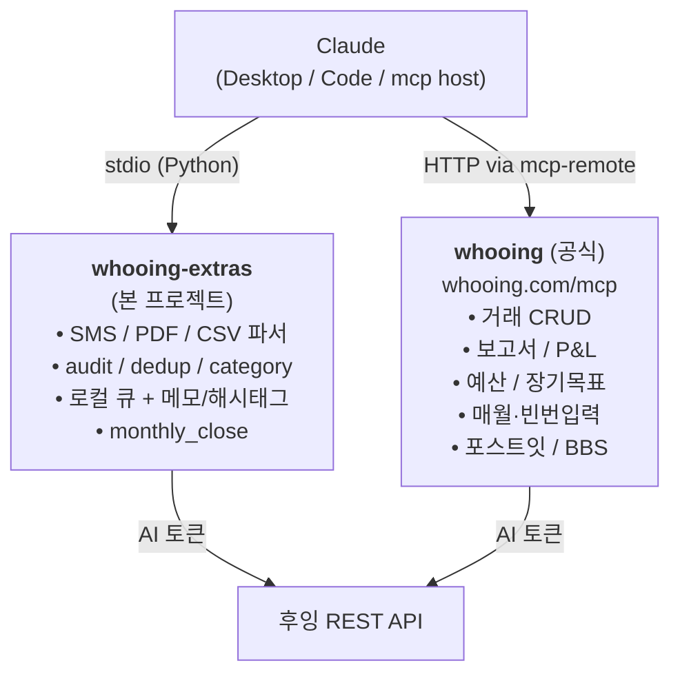

# whooing-mcp-server-wrapper

후잉 가계부([whooing.com](https://whooing.com))를 **Claude Code / Claude
Desktop 에서 자연어로 다루기** 위한 도구 묶음. **공식 후잉 MCP 서버**
(`https://whooing.com/mcp`) 와 함께 등록해 사용하는 **보완(wrapper) MCP
서버** 입니다.



> **두 MCP 모두 등록하는 게 정상 사용법입니다.** 공식 MCP 가 거래 입력/수정/
> 삭제·보고서·예산 등 핵심을 책임지고, 본 wrapper 가 공식이 안 주는 영역을
> 채웁니다 (SMS 알림 파싱 / LLM 입력 audit / 카드명세서 정산).

---

## 목차

- [wrapper 도구 21개](#wrapper-도구-21개)
- [Quickstart (5분)](#quickstart-5분)
  - [1. AI 연동 토큰 발급](#1-ai-연동-토큰-발급)
  - [2. 공식 후잉 MCP 등록](#2-공식-후잉-mcp-등록)
  - [3. 본 wrapper 설치 + 등록](#3-본-wrapper-설치--등록)
- [도구 reference](#도구-reference)
- [`[ai]` 마커 컨벤션 — 중요](#ai-마커-컨벤션--중요)
- [워크플로우 예시](#워크플로우-예시)
  - [매일: SMS 알림 → 입력](#매일-sms-알림--입력)
  - [주간: audit + dedup](#주간-audit--dedup)
  - [매월: 카드명세서 reconcile](#매월-카드명세서-reconcile)
  - [매월: PDF/HTML 명세서 자동 import + 정리](#매월-pdfhtml-명세서-자동-import--정리)
  - [거래에 메모·해시태그 달기 + 태그로 역조회](#거래에-메모해시태그-달기--태그로-역조회)
- [트러블슈팅](#트러블슈팅)
- [개발](#개발)
- [참고 / 라이선스](#참고--라이선스)

---

## wrapper 도구 21개

### 후잉 read-only 도구 (7)

| 도구 | 한 줄 설명 | API |
|---|---|---|
| `whooing_audit_recent_ai_entries` | 최근 N일 거래 중 LLM 이 입력한 것만 (memo 마커 기준) — **로컬 메모/태그 자동 부착** | GET /entries |
| `whooing_find_duplicates` | 같은 금액 + 유사 item + ±N일 거래쌍을 중복 후보로 | GET /entries |
| `whooing_reconcile_csv` | 카드사 명세서 CSV ↔ 후잉 entries 매칭, 누락/잉여 보고 | GET /entries |
| `whooing_reconcile_pdf` | 카드사 명세서 PDF ↔ 후잉 entries 매칭 | GET /entries |
| `whooing_csv_format_detect` | CSV 헤더 기반 카드사 자동 탐지 (디버깅) | (없음) |
| `whooing_pdf_format_detect` | PDF 첫 페이지 기반 카드사 탐지 (디버깅) | (없음) |
| `whooing_suggest_category` | 과거 거래 학습 → 새 가맹점의 l_account 추천 | GET /entries |

### 외부 텍스트 → 후잉 형식 변환 (1)

| 도구 | 한 줄 설명 | API |
|---|---|---|
| `whooing_parse_payment_sms` | SMS / Push 결제 알림 텍스트 → 후잉 항목 dict (지원: 신한/국민/현대/삼성/토스/카카오뱅크/우리) | (없음) |

### 로컬 임시 큐 (4) — 후잉 자체 자동입력 큐와 별개

| 도구 | 한 줄 설명 | API |
|---|---|---|
| `whooing_enqueue_pending` | 텍스트/parsed dict 를 로컬 SQLite 큐에 저장 | (없음) |
| `whooing_list_pending` | 큐 조회 (source/since 필터) | (없음) |
| `whooing_confirm_pending` | 후잉에 입력 완료 → 큐 항목 삭제 | (없음) |
| `whooing_dismiss_pending` | 입력 안 함 → 큐 항목 삭제 (의미 구분) | (없음) |

### 로컬 메모 + 해시태그 (5) — 후잉 자체 memo 보완

후잉 자체 `memo` 가 한 줄짜리 + 해시태그 검색이 부족한 부분을 로컬에서 보완.
거래 ID 별로 자유 길이의 `note` 와 다중 `hashtags` 를 보관하고, 거래 조회
시 자동 부착 + 해시태그로 역방향 조회.

| 도구 | 한 줄 설명 | API |
|---|---|---|
| `whooing_set_entry_note` | 거래 ID 에 로컬 메모/해시태그 저장 (note + hashtags) | (없음) |
| `whooing_get_entry_annotations` | 한 개 또는 여러 entry_id 의 로컬 메모/태그 조회 | (없음) |
| `whooing_remove_entry_note` | 특정 거래의 로컬 메모/태그 삭제 | (없음) |
| `whooing_list_hashtags` | 모든 unique 해시태그 + 사용 횟수 (prefix 필터) | (없음) |
| `whooing_find_entries_by_hashtag` | **역방향:** 해시태그 → 후잉 거래 fetch + 메모/태그 부착 | GET /entries |

저장 위치: 본 프로젝트의 `whooing-data.sqlite` (또는 `$WHOOING_QUEUE_PATH`
override). 후잉 서버의 `memo` 필드는 **변경하지 않음** — 별개의 로컬 레이어.

### 명세서 자동 import + cleanup (3) — 공식 MCP chained call

기존 read-only 정책의 **부분 예외** — 거래 입력/삭제가 필요하지만 wrapper
가 직접 후잉 REST 를 두드리지 않고 **공식 MCP 의 `entries-create` /
`entries-delete` 도구를 chained-call**. 모두 `confirm` 또는 `dry_run`
가드 + `statement_import_log` audit trail.

| 도구 | 한 줄 설명 | 거래 변경? |
|---|---|---|
| `whooing_import_pdf_statement` | PDF 카드명세서 → 자동 dedup + categorize + insert | 공식 MCP entries-create |
| `whooing_import_html_statement` | HTML 보안메일 (CryptoJS AES, Playwright 헤드리스 복호화) → import | 공식 MCP entries-create |
| `whooing_delete_entries` | 거래 ID 들 영구 삭제 | 공식 MCP entries-delete |

월말 정산 (`whooing_monthly_close`) — audit + dedup + reconcile + 합계 합성:

| 도구 | 한 줄 설명 | API |
|---|---|---|
| `whooing_monthly_close` | 한 달치: 통계 + audit + dedup + reconcile (CSV 또는 PDF) | GET /entries |

**21개 도구 합계.** 거래 변경 도구 3개 외 모두 read-only / 부수효과 없음.

---

## Quickstart (5분)

### 1. AI 연동 토큰 발급

후잉 → **사용자 > 계정 > 비밀번호 및 보안 > AI 토큰 발급**

- 토큰은 `__eyJh...` 로 시작 (앞 underscore 2개 포함 전체)
- scope: `read` / `write` / `messages` / `post_it` / `bbs` 중 발급 시 선택
- 본 wrapper 만 쓰려면 `read` 만 있으면 됨
- 공식 MCP 로 거래도 입력하려면 `write` 까지 체크

> **권장:** 본 가계부와 별도로 **테스트 섹션** 1개를 만든 뒤 모든 작업을
> 그 섹션에서 검증하세요. 본 가계부에 즉시 연결하면 LLM 의 학습 곡선 동안
> 의도치 않은 입력 위험이 있습니다.

### 2. 공식 후잉 MCP 등록

본 프로젝트는 **자격증명을 항상 `.env` 한 곳에서만 관리** 하는 정책입니다.
공식 MCP 등록도 wrapper 스크립트 (`bin/whooing-mcp-remote.sh`) 를 통해
`.env` 의 토큰을 자동으로 읽어 mcp-remote 의 `X-API-Key` 헤더로 넘깁니다.

> **`.env` 탐색 순서** (먼저 발견된 1개):
> 1. `$WHOOING_MCP_ENV` (명시 override)
> 2. 본 프로젝트의 `.env`
> 3. `~/.config/whooing-mcp/.env`

세 가지 등록 경로 중 환경에 맞는 것 1개:

#### A. Claude Desktop Connectors UI (Pro/Max/Team/Enterprise)

설정 파일을 안 건드리고 UI 만으로 — 토큰조차 입력 불필요 (OAuth):

1. Claude Desktop → **Settings → Connectors → Add custom connector**
2. URL 에 `https://whooing.com/mcp` 입력
3. 후잉 로그인 + scope 권한 승인

> 이 경로는 `.env` 와 무관 (OAuth 가 자체 처리).

#### B. Claude Desktop + wrapper 스크립트 (모든 플랜)

설정 파일:
```
Mac:     ~/Library/Application Support/Claude/claude_desktop_config.json
Windows: %APPDATA%\Claude\claude_desktop_config.json   (.sh 미지원 — A 또는 .ps1 자작)
```

```json
{
  "mcpServers": {
    "whooing": {
      "command": "/abs/path/to/whooing-mcp-server-wrapper/bin/whooing-mcp-remote.sh"
    }
  }
}
```

토큰 갱신 시: `.env` 만 수정 → Claude Desktop 재시작. config 재배포 불필요.

#### C. Claude Code CLI

```bash
# wrapper 스크립트를 stdio MCP 로 등록 (transport=stdio 가 기본)
claude mcp add whooing --scope user \
  -- /abs/path/to/whooing-mcp-server-wrapper/bin/whooing-mcp-remote.sh
```

> `--transport http` 직접 등록은 토큰을 `--header` 로 인라인해야 해서
> 본 정책상 비추 (cross-machine 동기화 어려움). 대신 wrapper 스크립트를
> stdio 로 등록.

검증: `claude mcp list` → `whooing` 보이면 성공.

### 3. 본 wrapper 설치 + 등록

#### 3.1 설치

```bash
git clone https://github.com/neoocean/whooing-mcp-server-wrapper
cd whooing-mcp-server-wrapper
python3.11 -m venv .venv      # 또는 3.12+
source .venv/bin/activate     # Windows: .venv\Scripts\activate
pip install -e .
```

#### 3.2 `.env` 작성

```bash
cp .env.example .env
$EDITOR .env
```

```
WHOOING_AI_TOKEN=__eyJh...
WHOOING_SECTION_ID=s133178   # 권장: 테스트 섹션. 미설정 시 첫 섹션 자동
```

`WHOOING_SECTION_ID` 가 미설정이면 첫 섹션이 자동 선택됩니다 — 의도치 않은
가계부가 잡힐 수 있어 **명시 강력 권장**.

#### 3.3 Claude Desktop 등록 — 공식 + 우리 둘 다 (.env 한 곳만 사용)

`claude_desktop_config.json`:

```json
{
  "mcpServers": {
    "whooing": {
      "command": "/abs/path/to/whooing-mcp-server-wrapper/bin/whooing-mcp-remote.sh"
    },
    "whooing-extras": {
      "command": "/abs/path/to/whooing-mcp-server-wrapper/.venv/bin/python",
      "args": ["-m", "whooing_mcp"]
    }
  }
}
```

토큰을 config 에 직접 박지 않습니다. 양쪽 모두 `.env` 자동 탐색:
- `whooing` (공식): wrapper 스크립트가 `.env` 에서 `WHOOING_AI_TOKEN`
  읽어 `--header X-API-Key` 로 mcp-remote 에 전달
- `whooing-extras`: `server.py` 가 `.env` 자동 탐색 (cwd 무관 —
  `__file__` 기반으로 프로젝트 루트 발견)

`examples/claude_desktop_config.json` 에 동일 템플릿 있음.

#### 3.4 Claude Code 등록 (대안)

`claude mcp add` 는 자체 옵션과 sub-command 의 옵션을 분리하기 위해 **`--`
구분자** 가 필요합니다.

```bash
# 공식 MCP — wrapper 스크립트를 stdio 로 등록
claude mcp add whooing --scope user \
  -- /abs/path/to/whooing-mcp-server-wrapper/bin/whooing-mcp-remote.sh

# 본 wrapper — venv 의 python 으로 모듈 실행
claude mcp add whooing-extras --scope user \
  -- /abs/path/to/whooing-mcp-server-wrapper/.venv/bin/python -m whooing_mcp
```

토큰 / SECTION_ID 같은 자격증명은 어느 명령에도 안 박힙니다 — 모두
`.env` 자동 탐색으로 해결.

검증:
```bash
claude mcp list                  # whooing + whooing-extras 둘 다 보여야
```

#### 3.5 (선택) `whooing-mcp.toml` 옵션

대부분의 사용자는 기본값으로 충분 — 만들 필요 없음. 옵션을 조정하고
싶으면:

```bash
cp whooing-mcp.toml.example whooing-mcp.toml
$EDITOR whooing-mcp.toml
```

현재 노출된 옵션은 `[p4_sync] enabled` 하나 (default `false`). 자세한
설명은 `.example` 파일의 주석 참조. 본 toml 도 `.gitignore` 차단 — 머신
간 동기화 책임은 사용자에게.

#### 3.6 검증

Claude 와 새 대화를 시작하고:

> "내 후잉 섹션 목록 보여줘"

→ 공식 MCP 가 응답.

> "지난 7일 동안 LLM 이 입력한 거래 보여줘"

→ 본 wrapper 의 `whooing_audit_recent_ai_entries` 가 호출됨 (지금은 0개일
것이고 정상).

---

## 도구 reference

각 도구의 입력/출력은 DESIGN §6 에 명세. 아래는 LLM 호출 관점의 요약.

### `whooing_audit_recent_ai_entries`

LLM 이 (사용자 위임으로) 입력한 거래만 조회.

```
입력: days=7, marker="[ai]", section_id=null
출력: { entries: [...], total, marker_used, section_id, date_range, scanned_total, note }
```

자연어 트리거:
> "지난 주에 너가 입력한 거래 다 보여줘"
> "최근 30일 동안 [ai] 로 시작하는 메모만 골라봐"

### `whooing_find_duplicates`

중복 후보 탐지. 자동 삭제 안 함.

```
입력: start_date, end_date, section_id?, tolerance_days=1, min_similarity=0.85
출력: { pairs: [{entry_a, entry_b, why: [...]}], total_checked, ... }
```

자연어:
> "이번 달 후잉에 중복 입력된 거래 있는지 찾아봐"
> "5월 1일~5월 9일 사이에 같은 금액·비슷한 가맹점인 거래쌍 알려줘"

### `whooing_parse_payment_sms`

SMS / Push 알림 → 항목 dict. **API 호출 없음**.

```
입력: text, issuer_hint="auto"  (auto / shinhan_card / kookmin_card)
출력: { proposed_entry: {...}, confidence, notes, parser_used, next_step_hint }
       또는 매칭 실패 시 { proposed_entry: null, supported_issuers: [...] }
```

자연어:
> "[Web발신] 신한카드(1234)승인 ... 6,200원 ... 스타벅스 ... 이거 후잉에
> 입력해줘"

LLM 흐름: parse → 사용자 확인 → 공식 MCP 의 `add_entry` 호출 (memo 첫
단어로 `[ai]` 권장).

### `whooing_reconcile_csv`

카드사 명세서 CSV ↔ 후잉 entries 매칭.

```
입력: csv_path (절대), issuer="auto", start_date?, end_date?, section_id?,
      tolerance_days=2, tolerance_amount=0
출력: { summary: {csv_total, whooing_total, matched_count,
                  missing_in_whooing_count, extra_in_whooing_count},
        matched, missing_in_whooing, extra_in_whooing,
        adapter_used, ... }
```

자연어:
> "/Users/me/Downloads/shinhan_2026_05.csv 와 후잉 5월 거래 비교해줘"

LLM 흐름: reconcile → 사용자 확인 → 누락 항목별 add_entry.

지원 카드사 (v0.1): `shinhan_card`, `kookmin_card`. 추가는 §개발 참조.

### `whooing_csv_format_detect`

CSV 헤더만 보고 카드사 추측 (디버깅용).

```
입력: csv_path (절대)
출력: { detected_issuer, confidence, header_sample, column_mapping_proposed,
        supported_issuers }
```

`reconcile_csv` 가 `issuer=auto` 로 매칭 실패할 때 사용.

### `whooing_set_entry_note` / `whooing_get_entry_annotations` / `whooing_remove_entry_note`

후잉 거래 ID 별 **로컬 메모 + 해시태그** 저장. 후잉 자체 `memo` 필드는
한 줄짜리 + 해시태그 검색 부재라 본 도구로 보완. 본 wrapper 의 로컬 SQLite
에만 저장 — 후잉 서버의 거래 자체는 변경 X.

```
set_entry_note 입력: entry_id, note?, hashtags?, section_id?
                     (note 또는 hashtags 중 최소 하나)
              출력: { annotation: {entry_id, note, hashtags, ...} }

get_entry_annotations 입력: entry_ids (str | list[str])
                      출력: { annotations: { entry_id: {note, hashtags, ...} },
                              found_count, queried_count }

remove_entry_note 입력: entry_id
                  출력: { removed: bool }
```

**해시태그 입력 형식 (양쪽 다 허용):**
- list: `["식비", "#출장", "work-trip"]`
- 문자열: `"#식비 #출장 work-trip"` (공백/콤마로 분리)

자동 정규화: `#` 제거, 양옆 공백 strip, 빈 토큰 무시. 내부 공백 있는 list
요소는 reject.

자연어:
> "이 거래 (entry_id=e_real_42) 에 '#출장 #식비' 태그 달아줘"
> "이번 출장에서 쓴 거 메모로 '서울 → 부산' 적어줘"

### `whooing_list_hashtags`

저장된 모든 unique 해시태그와 사용 횟수.

```
입력: prefix? (optional, 시작 매칭 필터)
출력: { hashtags: [{tag, count}], total_unique, prefix_filter }
```

자연어:
> "내가 쓰는 해시태그 다 보여줘"
> "'work' 로 시작하는 태그 모음"

### `whooing_find_entries_by_hashtag` (역방향 조회)

해시태그 → 매칭 entry_id 들 → **후잉에서 fetch** → 메모/태그 자동 부착.

```
입력: hashtag, section_id?, lookback_days=365
출력: { entries: [...with local_annotations attached...], total,
        hashtag_searched, missing_in_remote_count, missing_in_remote_ids }
```

`missing_in_remote_ids`: 로컬엔 태그가 있지만 lookback 안 후잉에 안 보이는
entry_id (삭제됐거나 범위 밖). lookback_days 늘리거나 `whooing_remove_entry_note`
로 stale annotation 정리.

자연어:
> "'#출장' 태그 붙은 거래 다 보여줘"
> "지난 1년 동안 '#식비' 로 분류한 거 모아봐"

### `whooing_import_pdf_statement`

PDF 카드명세서 자동 import — dedup + auto-categorize + 공식 MCP 통한 안전 insert.

```
입력: pdf_path (abs), r_account_id (필수, 카드 매핑 예 'x80'),
      issuer='auto', section_id?, card_label?,
      dedup_tolerance_days=2, auto_categorize=True,
      fallback_l_account_id='x50', dry_run=True, confirm_insert=False
출력: { summary, proposed, matched_existing, inserted, failed,
        tracking_log_ids, dry_run, note }
```

자연어:
> "이 PDF 명세서 미리 분석해서 안 들어간 거 보여줘: /Users/me/Downloads/2026-05.pdf"
> "그대로 입력해줘"

지원 카드사 (v0.1.8): 신한카드 PDF, 현대카드 PDF.

### `whooing_import_html_statement`

HTML 보안메일 (CryptoJS AES 암호화) 자동 import — Playwright 헤드리스 복호화
+ PDF import 와 동일한 흐름.

```
입력: html_path (abs), r_account_id (필수),
      password_env_var='WHOOING_HANACARD_PASSWORD',
      issuer='auto', section_id?, card_label?,
      dry_run=True, confirm_insert=False
출력: 위 PDF import 와 동일 + issuer_used 필드
```

지원 (v0.1.8): 하나카드 보안메일 (.html). 의존성 — `playwright install chromium`
1회 (~150MB).

자연어:
> "/Users/me/Desktop/hanacard_20260527.html 임포트해줘"

### `whooing_delete_entries`

거래 영구 삭제 — 공식 MCP `entries-delete` chained call.

```
입력: entry_ids (str | list[str]), section_id?,
      confirm (bool, **True 필수**), update_import_log=True
출력: { summary: {requested, deleted_count, failed_count},
        deleted, failed, log_updates, via='official_mcp/entries-delete' }
```

자연어:
> "후잉 entry 1710800, 1710801 삭제해줘"

`confirm=True` 명시 안 하면 ToolError raise (재무 데이터 영구 삭제 가드).

### `local_annotations` 자동 부착

`whooing_audit_recent_ai_entries` / `whooing_find_entries_by_hashtag` 의
응답에 각 entry 별 `local_annotations` 필드가 자동 추가됩니다:

```python
{
  "entry_id": "e_real_42",
  "entry_date": "20260509",
  "money": 6200,
  "item": "스타벅스",
  "memo": "[ai] 음성 위임",
  "local_annotations": {              # ← 본 wrapper 가 추가
    "note": "서울 출장 첫 날",
    "hashtags": ["출장", "서울", "식비"]
  }
}
```

로컬 데이터 없는 entry 는 `local_annotations: null`. (find_duplicates,
reconcile, monthly_close 등은 응답 크기 제어 위해 자동 부착 안 함 — 필요
시 LLM 이 별도 `whooing_get_entry_annotations` 호출.)

---

## `[ai]` 마커 컨벤션 — 중요

`whooing_audit_recent_ai_entries` 가 LLM 이 입력한 거래를 추적하려면
**컨벤션** 이 필요합니다. 공식 MCP 의 `add_entry` 도구에 우리가 hook 을
못 거므로, LLM 에 다음을 안내해야 합니다:

> **사용자 위임으로 거래를 입력할 때 memo 첫 단어를 `[ai]` 로 시작해.**

대화 시작 부 또는 시스템 프롬프트에 박아두세요:

```
후잉에 거래를 입력할 때, 내가 명시적으로 위임한 경우 add_entry 의
memo 필드 첫 단어를 '[ai]' 로 시작해줘. 예:
  memo='[ai] 강남 스타벅스 음성 위임'
그래야 whooing_audit_recent_ai_entries 로 나중에 추적할 수 있어.
```

(Claude Code 사용자라면 `~/.claude/CLAUDE.md` 또는 프로젝트 `CLAUDE.md` 에
명시.)

---

## 워크플로우 예시

### SMS 받았는데 지금 처리 못함 (큐에 저장 후 나중에)

1. SMS 도착 → 텍스트 복사
2. Claude 에:
   > "이거 지금 처리할 시간 없어. 큐에 넣어두자: [SMS 텍스트]"
3. Claude 가:
   - `whooing_parse_payment_sms` 호출 → proposed_entry dict
   - `whooing_enqueue_pending(parsed=proposed_entry, source='sms', issuer='shinhan_card')` 호출
4. 응답: `pending_id=42, queue_total=N`

나중에 (예: 점심시간):
> "오늘 큐에 쌓인 거 다 처리하자"

→ Claude 가 `whooing_list_pending(since=오늘아침)` 호출 → N개 항목 표시 →
각각:
  - `whooing_suggest_category(merchant=...)` → 카테고리 후보
  - 사용자 확인 → 공식 `add_entry(memo='[ai] queue: ...')` → 성공 시
  - `whooing_confirm_pending(pending_id=...)` → 큐 정리

무시할 항목은 `whooing_dismiss_pending(pending_id, reason='이미 입력됨')`.

### 매일: SMS 알림 → 즉시 입력

1. 카드 결제 → 카드사 SMS 도착
2. 텍스트 복사
3. Claude 에:
   > "이거 후잉에 넣어줘:
   > [Web발신]
   > 신한카드(1234)승인
   > 홍****님
   > 6,200원 일시불
   > 05/09 14:23
   > 스타벅스강남점"
4. Claude 가 `whooing_parse_payment_sms` 호출 → proposed_entry dict
5. Claude 가 사용자에게:
   > "스타벅스강남점에서 6,200원 (신한카드 일시불, 5/9). 외식 카테고리
   > 맞아? 메모는 비워둬도 돼?"
6. 사용자 "응"
7. Claude 가 (선택) `whooing_suggest_category(merchant="스타벅스강남점")` 호출 →
   `[{l_account:'외식', confidence:0.9, evidence:[과거 스타벅스 4건 모두 외식]}]`
8. Claude 가 공식 MCP 의 `add_entry` 호출:
   - section_id, entry_date=20260509, money=6200,
     l_account="외식", r_account="신한카드",
     item="스타벅스강남점", **memo="[ai] SMS 위임"**
9. 완료 보고

### 주간: audit + dedup

매주 일요일:
> "지난 주에 너가 입력한 거래 다 보여주고, 중복으로 보이는 거 있는지도 같이
> 찾아줘"

→ Claude 가 `whooing_audit_recent_ai_entries(days=7)` + `whooing_find_duplicates(start_date=일주일전, end_date=오늘)` 호출. 결과를 사용자에게 보여주고, 중복 후보가 있으면 "이 쌍 중 어느 걸 지울까?" 질문.

### 거래에 메모·해시태그 달기 + 태그로 역조회

후잉 자체 memo 가 부족할 때:

1. 후잉에 거래 입력 (공식 MCP `add_entry`) — entry_id 받음
2. Claude 에:
   > "방금 입력한 거래 (entry_id=e_real_42) 에 메모 '서울 출장 첫 날' 달고
   > 태그 #출장 #서울 #식비 붙여줘"
3. Claude 가 `whooing_set_entry_note(entry_id='e_real_42', note='서울 출장
   첫 날', hashtags=['출장', '서울', '식비'])` 호출
4. 응답: 저장된 annotation dict

나중에 (예: 출장비 정산):
> "지난 5월 출장 관련 거래 모아봐"

→ Claude 가 `whooing_find_entries_by_hashtag(hashtag='출장')` 호출 →
N건의 후잉 거래 + 각 거래의 로컬 메모/태그 함께 반환 → 합계·기간 등 분석.

또는 audit 결과에서:
> "지난 주 LLM 입력 거래 보여줘"

→ `whooing_audit_recent_ai_entries(days=7)` → 각 entry 의 `local_annotations`
필드에 메모/태그 자동 부착되어 표시.

태그 통계:
> "내가 자주 쓰는 태그 top 10 보여줘"

→ `whooing_list_hashtags()` → count 내림차순.

### 매월: PDF/HTML 명세서 자동 import + 정리

`whooing_import_pdf_statement` / `whooing_import_html_statement` 가 dedup +
auto-categorize + 공식 MCP insert 까지 한 번에 처리. dry_run 으로 미리 보고,
확인 후 실 입력.

```mermaid
sequenceDiagram
    participant User as 사용자
    participant LLM
    participant Wrap as wrapper
    participant Off as 공식 후잉 MCP
    participant W as 후잉 ledger

    User->>LLM: "5월 명세서 import 해 (hanacard_20260527.html)"
    LLM->>Wrap: import_html_statement(dry_run=True)
    Wrap->>Wrap: Playwright 복호화 + 파싱
    Wrap->>W: list_entries(범위, paginated)
    Wrap->>Wrap: dedup + suggest_category
    Wrap-->>LLM: 12 proposed (matched 53 skipped)
    LLM-->>User: "12건 신규. 이대로 입력?"
    User->>LLM: "응"
    LLM->>Wrap: import_html_statement(dry_run=False, confirm_insert=True)
    loop for each proposed
        Wrap->>Off: tools/call entries-create
        Off->>W: POST /entries.json
        W-->>Off: entry_id
        Off-->>Wrap: result
        Wrap->>Wrap: log_one(status='inserted')
    end
    Wrap-->>LLM: {inserted: 12, failed: 0}
    LLM-->>User: 완료 보고
```

중복이 들어갔다면 `whooing_delete_entries(entry_ids=[...], confirm=True)` 로
공식 MCP 통해 정리 (역시 자동 tracking 동기화).

### 매월: 카드명세서 reconcile

매월 5일 (전월 명세 도착 후):

1. 카드사 사이트에서 4월 명세 CSV 다운로드 → `~/Downloads/shinhan_2026_04.csv`
2. Claude 에:
   > "이 파일이랑 후잉 4월 거래 비교해줘: /Users/me/Downloads/shinhan_2026_04.csv"
3. Claude 가 `whooing_reconcile_csv(csv_path=..., issuer='auto')` 호출
4. 결과 요약:
   - matched: 42건
   - missing_in_whooing: 5건 (CSV 에 있는데 후잉에 없는 거래)
   - extra_in_whooing: 2건 (후잉에 있는데 CSV 에 없는 거래)
5. Claude 가:
   > "5건 누락 발견. 다음과 같아: ... 다 입력할까?"
6. 사용자 "응" → Claude 가 5번 `add_entry` (각 memo `[ai] CSV 정산`)
7. extra 2건은 사용자가 수동 확인 (환불/현금/타카드 가능성)

---

## 트러블슈팅

| 증상 | 원인 / 해결 |
|---|---|
| `WHOOING_AI_TOKEN 미설정` | `.env` 탐색 4경로 모두 실패. server stderr 의 "Tried: [...]" 목록 확인. 가장 흔한 fix: 프로젝트 루트의 `.env` 에 `WHOOING_AI_TOKEN=__eyJh...` 추가 |
| `error.kind="AUTH"` | 토큰 만료/revoke. 후잉에서 재발급 후 .env (그리고 Claude Desktop config) 갱신. |
| `error.kind="RATE_LIMIT"` (`code=402`) | 일일 20,000회 초과. 응답의 `rest_of_api` 가 0 에 가까움. 다음날까지 대기 |
| `error.kind="RATE_LIMIT"` (`code=429`) | 분당 20회 초과. 1분 대기 후 재시도 |
| 의도와 다른 가계부 데이터 | `WHOOING_SECTION_ID` 미설정 → 첫 섹션 자동. .env 명시 |
| `whooing_parse_payment_sms` 가 매칭 실패 | 지원 issuer 외 (`supported_issuers` 응답 확인). 새 패턴은 `parsers/sms/<issuer>.py` 추가 |
| `whooing_reconcile_csv: 'CSV format not detected'` | header 키워드가 알려진 패턴과 다름. `whooing_csv_format_detect` 호출해 header_sample 확인 후 adapter 보강 |
| Claude Desktop 에서 `whooing-extras` 가 안 보임 | config 의 `command` 가 venv 의 `python` 절대경로인지 확인 (전역 python 으로는 import 실패) |
| `WHOOING_AI_TOKEN prefix 가 '__' 가 아님` 경고 | sanity check (`server.py` bootstrap). 실제 후잉 토큰은 `__eyJh...` 시작. .env 의 토큰 값이 잘못 들어갔을 가능성 — 후잉에서 재발급한 값을 그대로 (앞 underscore 2개 포함) 복사 |
| `WHOOING_AI_TOKEN 길이 (X) 가 비정상적으로 짧음` 경고 | 같은 sanity check. 보통 100자 이상. 잘림 가능성 |
| 도구 호출이 자주 멈춤 (sleep) | client-side rate limit (분당 20 cap). DEBUG 로그에서 "rate-limit throttle" 확인. `WHOOING_RPM_CAP` env 로 조절 가능하나 서버 측 한도 (분당 20, 일 20,000) 가 진짜 제약 |
| 디버그 로그에 `webhook_token` 값이 보임 | 본 서버는 `errors.sanitize_for_log()` 로 마스크. 직접 응답 dump 코드를 쓰셨다면 같은 헬퍼 적용 |
| `claude mcp add ... python -m whooing_mcp` → `error: unknown option '-m'` | `--` 로 자체 옵션과 sub-command 분리 필요. `claude mcp add <name> [options] -- <cmd> [<args>...]` 형식. README §3.4 예시 참조 |
| 같은 도구 이름이 두 서버에 노출되어 LLM 이 혼동 | 본 wrapper 는 공식과 이름 겹치지 않게 `whooing_*` prefix + `_extras` 같은 변별 미사용. 그래도 헷갈리면 사용자 프롬프트에 "extras 의 X 도구를 써" 명시 |

---

## 개발

### 의존성

`Python 3.11+`, `pip install -e .[dev]` 가 dev 도구까지 설치
(`pytest`, `pytest-asyncio`, `respx`).

### 테스트

```bash
source .venv/bin/activate
pytest -q
# 72 passed (CL #4 시점)
```

테스트는 모두 합성 fixture 기반이라 후잉 자격증명 불필요.

### Live smoke (수동, 후잉 자격증명 필요)

```bash
python tests/_live_smoke.py [--section <id>] [--days 90]
```

- `.env` 에서 `WHOOING_AI_TOKEN` + (선택) `WHOOING_SECTION_ID` 로드
- `/sections.json` + `/entries.json` 호출 검증
- 응답 shape 만 stderr 출력 (실 값은 안 찍음)
- fixture 는 합성 (`tests/_live_smoke.py` 의 `SYNTHETIC_*`) 만 commit

### 새 SMS issuer 추가

1. `src/whooing_mcp/parsers/sms/<issuer>.py` 작성
   - `ISSUER`, `ACCOUNT_GUESS`, `parse(text) -> ParseResult | None`
2. `src/whooing_mcp/parsers/sms/__init__.py` 의 `_REGISTRY` 에 등록
3. `tests/fixtures/sms/<issuer>_*.txt` 합성 샘플 추가
4. `tests/test_sms_parsers.py` 에 회귀 테스트 추가

### 새 CSV adapter 추가

1. `src/whooing_mcp/csv_adapters/<issuer>.py` 작성
   - `ISSUER`, `score_header(header) -> float`,
     `propose_mapping(header) -> dict`, `parse_csv(path) -> [CSVRow]`
2. `src/whooing_mcp/csv_adapters/__init__.py` 의 `_REGISTRY` 에 등록
3. `tests/fixtures/csv/<issuer>_sample.csv` 합성 샘플
4. `tests/test_csv_adapters.py` 에 회귀

### 설계 / 결정 이력

- [DESIGN.md](DESIGN.md) — 전체 설계 (v2 wrapper 모델). v1 폐기 사유,
  CRUD 미지원 결정, 5 도구 명세, rate limit, 보안 가드 등.

---

## 참고 / 라이선스

### 후잉 공식

- [whooing.com](https://whooing.com)
- [whooing.com/mcp](https://whooing.com/mcp) — 공식 MCP 서버 가이드
- [whooing.com/api/docs](https://whooing.com/api/docs) — REST API
- 문의: support@whooing.com

### MCP

- [modelcontextprotocol.io](https://modelcontextprotocol.io)
- [`mcp-remote`](https://www.npmjs.com/package/mcp-remote) — HTTP MCP 를
  stdio 로 bridging 하는 NPX

### 라이선스

MIT.
