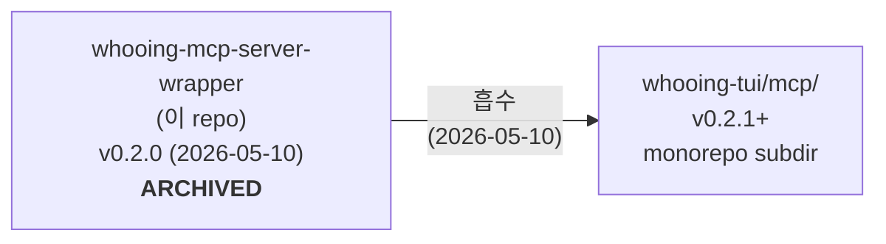

# whooing-mcp-server-wrapper — **ARCHIVED**

> **이 프로젝트는 종료되었습니다.** 본 wrapper 의 모든 코드 / 테스트 / 문서는
> 2026-05-10 에 [whooing-tui](https://github.com/neoocean/whooing-tui) monorepo
> 의 [`mcp/`](https://github.com/neoocean/whooing-tui/tree/main/mcp)
> 서브디렉터리로 이전되었습니다. 새 위치에서 동일한 기능 (MCP 서버, 14 도구)
> 이 계속 유지됩니다.

## 새 위치

| | 경로 |
|---|---|
| GitHub | https://github.com/neoocean/whooing-tui — `mcp/` 디렉터리 |
| 패키지명 | `whooing-mcp-server` (이전: `whooing-mcp-server-wrapper`) |
| 설치 | `cd whooing-tui && make install` (core + tui + mcp 모두 editable) |
| MCP 도구 수 | 14 (변경 없음) |
| Claude Desktop 등록 | `claude mcp add whooing-extras /Users/.../whooing-tui/mcp/.venv/bin/python -m whooing_mcp` (경로만 갱신) |

## 지난 진행 요약 (v0.1.0 → v0.2.0)

본 wrapper 는 2026-05-09 ~ 2026-05-10 사이 다음 단계를 거쳐 진화:

| 버전 | 날짜 | 핵심 변경 |
|---|---|---|
| v0.1.0 | 2026-05-09 | 초기 — 후잉 REST 클라이언트 + audit / find_duplicates / parse_payment_sms |
| v0.1.1–v0.1.7 | 2026-05-09 | SMS issuer 7종 (신한/국민/현대/삼성/토스/카카오뱅크/우리), CSV adapter 4종, PDF adapter (신한/현대), reconcile_csv/pdf 도구 |
| v0.1.8 | 2026-05-09 | HTML 보안메일 import (하나카드 — Playwright 헤드리스 + CryptoJS AES) |
| v0.1.9 | 2026-05-09 | 거래 ↔ 첨부파일 (entry_attachments) — 후잉 미지원 영역 보완 |
| v0.1.10 | 2026-05-10 | P4 sync 다중 파일 일반화 (db + 첨부 단일 CL) |
| v0.1.11 | 2026-05-10 | 현대카드 HTML import (Yettiesoft vestmail) + 카드 패스워드 통합 (`WHOOING_CARD_HTML_PASSWORD` 한 키 — 한국 카드사 모두 생년월일 6자리 공통) |
| v0.1.12 | 2026-05-10 | P4 빈 CL leak 수정 + 테스트 격리 강화 |
| **v0.2.0** | **2026-05-10** | **Breaking** — 10 도구 (statement import, 첨부, 메모/태그) 를 [whooing-tui](https://github.com/neoocean/whooing-tui) 로 이전. wrapper 는 LLM 자동화 14 도구로 슬림화. SQLite read-only 강제. `~/.whooing/` 공유 데이터 path. |
| v0.2.1 | 2026-05-10 | (whooing-tui/mcp 안에서) monorepo 흡수. 본 repo 는 archive. |

자세한 변경 내역은 [`mcp/CHANGELOG.md`](https://github.com/neoocean/whooing-tui/blob/main/mcp/CHANGELOG.md) 참조.

### 주요 단일 결정들 (검색 키워드)

- **SQLite db owner = whooing-tui (write), wrapper = read-only** —
  `~/.whooing/whooing-data.sqlite`. 같은 머신에서 두 도구가 같은 데이터를 봄.
- **어댑터 (html / csv / pdf) + 첨부 storage 는 `whooing-core` 라이브러리** —
  whooing-tui monorepo 의 `core/`. wrapper / tui 가 같이 import.
- **카드 보안메일 패스워드는 단일 env 키 `WHOOING_CARD_HTML_PASSWORD`** —
  한국 카드사 (하나/현대/...) 모두 사용자 생년월일 6자리 (YYMMDD) 공통.

## 흡수 결정 과정

[`ARCHIVED.md`](ARCHIVED.md) 에 사용자가 결정에 이른 대화 흐름을 기록했습니다.
요지:

1. v0.2.0 에서 10 도구를 whooing-tui 로 이전한 후, 본 wrapper 와 whooing-tui 가
   같은 데이터 / 같은 .env / 같은 whooing-core 코드를 공유하는 상황.
2. 사용자가 1인이고 외부 contributor / 분리 배포 시나리오가 없음.
3. 분리가 만들어내는 가치 (격리, 독립적 release) 가 거의 0; ceremony (push 2번,
   version 2개, CHANGELOG 2개, repo 관리 2개) 는 정당화되지 않음.
4. **결정**: monorepo 흡수. wrapper repo 는 archive — README + ARCHIVED.md 만 남김.

## License

MIT (LICENSE 파일 보존). 새 위치의 라이선스는 동일.
